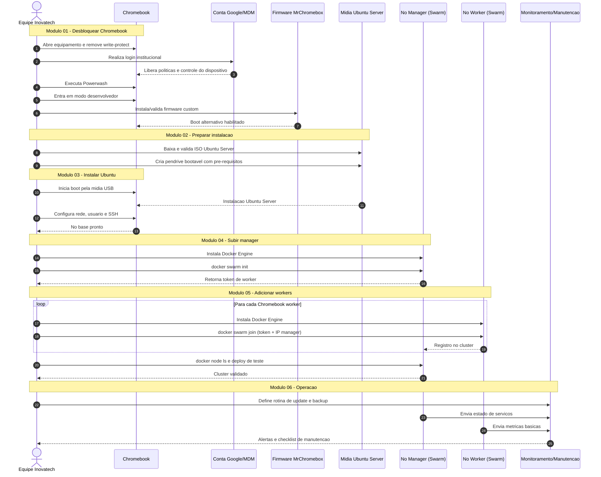

# Diagramas do Projeto ChromeCluster

## Sequence Diagram

```mermaid
sequenceDiagram
    autonumber
    actor Equipe as Equipe Inovatech
    participant CB as Chromebook
    participant MDM as Conta Google/MDM
    participant FW as Firmware MrChromebox
    participant USB as Midia Ubuntu Server
    participant MGR as No Manager (Swarm)
    participant WRK as No Worker (Swarm)
    participant MON as Monitoramento/Manutencao

    Note over Equipe,CB: Modulo 01 - Desbloquear Chromebook
    Equipe->>CB: Abre equipamento e remove write-protect
    Equipe->>MDM: Realiza login institucional
    MDM-->>CB: Libera politicas e controle do dispositivo
    Equipe->>CB: Executa Powerwash
    Equipe->>CB: Entra em modo desenvolvedor
    Equipe->>FW: Instala/valida firmware custom
    FW-->>CB: Boot alternativo habilitado

    Note over Equipe,USB: Modulo 02 - Preparar instalacao
    Equipe->>USB: Baixa e valida ISO Ubuntu Server
    Equipe->>USB: Cria pendrive bootavel com pre-requisitos

    Note over Equipe,CB: Modulo 03 - Instalar Ubuntu
    Equipe->>CB: Inicia boot pela midia USB
    USB-->>CB: Instalacao Ubuntu Server
    Equipe->>CB: Configura rede, usuario e SSH
    CB-->>Equipe: No base pronto

    Note over Equipe,MGR: Modulo 04 - Subir manager
    Equipe->>MGR: Instala Docker Engine
    Equipe->>MGR: docker swarm init
    MGR-->>Equipe: Retorna token de worker

    Note over Equipe,WRK: Modulo 05 - Adicionar workers
    loop Para cada Chromebook worker
        Equipe->>WRK: Instala Docker Engine
        Equipe->>WRK: docker swarm join (token + IP manager)
        WRK-->>MGR: Registro no cluster
    end
    Equipe->>MGR: docker node ls e deploy de teste
    MGR-->>Equipe: Cluster validado

    Note over Equipe,MON: Modulo 06 - Operacao
    Equipe->>MON: Define rotina de update e backup
    MGR->>MON: Envia estado de servicos
    WRK->>MON: Envia metricas basicas
    MON-->>Equipe: Alertas e checklist de manutencao
```

## Flowchart

```mermaid
flowchart TD
    A[Inicio do Projeto] --> B[Modulo 01: Desbloquear Chromebook]
    B --> B1[Remover write-protect]
    B1 --> B2[Powerwash e liberar MDM]
    B2 --> B3[Entrar em modo desenvolvedor]
    B3 --> B4[Instalar firmware MrChromebox]

    B4 --> C[Modulo 02: Criar midia Ubuntu Server]
    C --> C1[Baixar ISO oficial]
    C1 --> C2[Validar ISO]
    C2 --> C3[Criar pendrive bootavel]

    C3 --> D[Modulo 03: Instalar Ubuntu no Chromebook]
    D --> D1[Boot via USB]
    D1 --> D2[Configurar rede, usuario e SSH]
    D2 --> D3[Validar no base]

    D3 --> E[Modulo 04: Configurar manager Swarm]
    E --> E1[Instalar Docker Engine]
    E1 --> E2[docker swarm init]
    E2 --> E3[Gerar token de worker]

    E3 --> F[Modulo 05: Adicionar workers]
    F --> F1[Instalar Docker em cada worker]
    F1 --> F2[docker swarm join]
    F2 --> F3[Validar com docker node ls]

    F3 --> G[Modulo 06: Operacao e manutencao]
    G --> G1[Atualizacoes periodicas]
    G1 --> G2[Monitoramento de servicos]
    G2 --> G3[Backup e contingencia]
    G3 --> H[Fim / Cluster operacional]
```