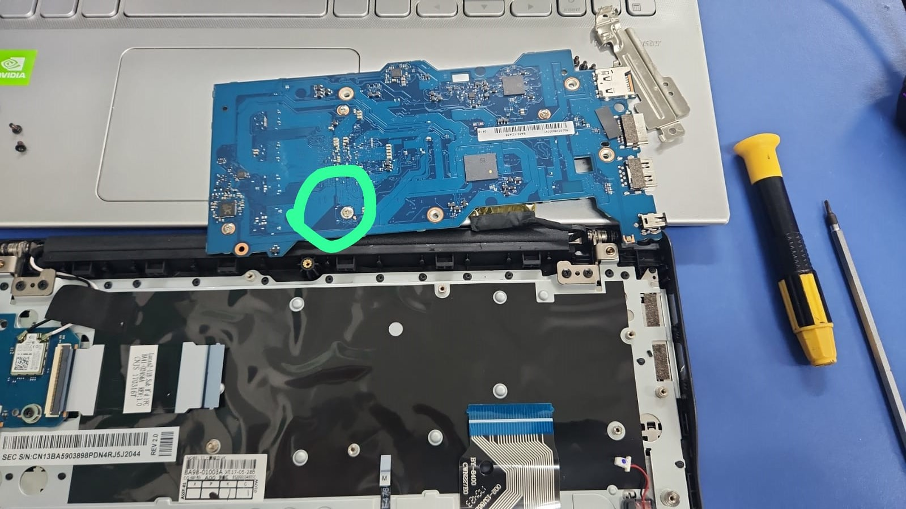
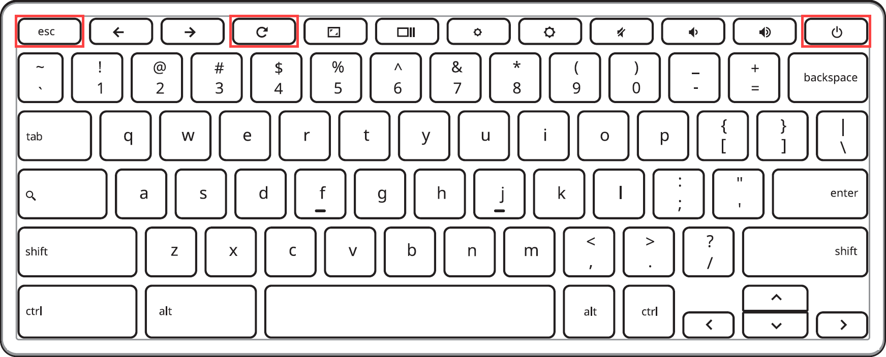
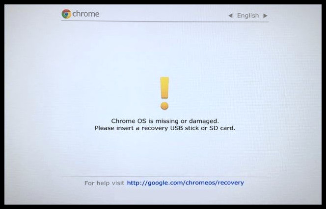
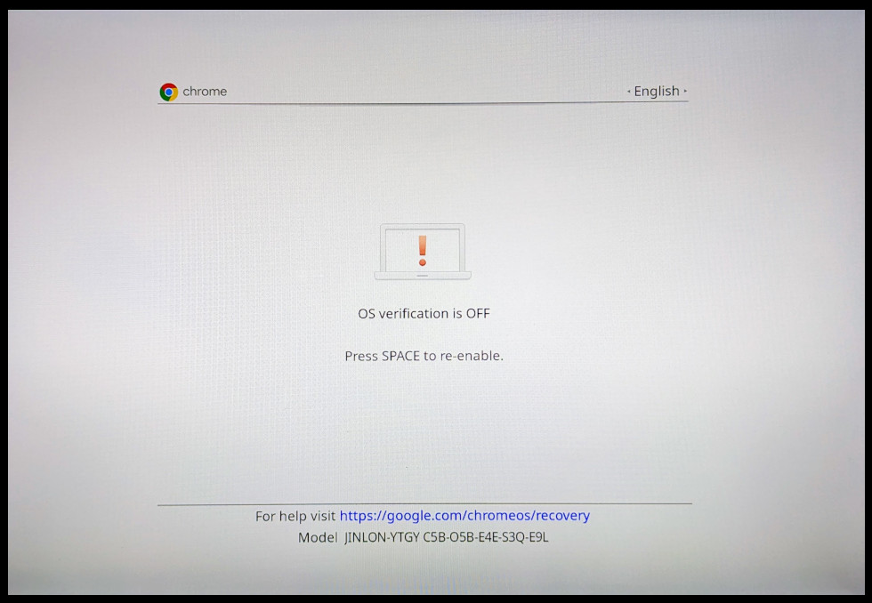

# Modulo 01 - Desbloquear Chromebook

Guia de pre-instalacao para desbloquear o Chromebook e liberar o firmware para boot de outros sistemas operacionais.

## Objetivo

Remover bloqueios fisicos e de firmware para preparar o equipamento para a instalacao do Ubuntu Server.

## Sumario

1. [Liberar a trava de hardware](#1-liberar-a-trava-de-hardware)
2. [Powerwash](#2-powerwash)
3. [Entrar em modo desenvolvedor](#3-entrar-em-modo-desenvolvedor)
4. [Instalar firmware custom](#4-instalar-firmware-custom)

## 1. Liberar a trava de hardware

1. **Remova os parafusos da tampa traseira do notebook.**


2. **Desencaixe a tampa traseira** puxando no vao da conexao com o monitor.


3. **Remova a capa metalica e solte a placa:**
   - Remova a capa metalica dos conectores (amarelo).
   - Remova os parafusos da placa-mae (vermelho).
   - Desconecte os cabos (verde).

> Atenção: nao remova o cabo do monitor. Esse cabo e fragil e pode romper com facilidade.


4. **Remova o parafuso da trava de hardware** (na parte traseira da placa-mae).




5. **Remonte o equipamento** e avance para o proximo passo.

## 2. Powerwash

Ligue o chromebook, conecte ao wifi e aguarde alguns minutos, alguns chromebooks não tiveram suas licenças baixadas ainda, nesses casos na tela inicial tem uma mensagem falando que o dispositivo é gerenciado pela universidade. Basta aguardar e ele vai dar o powerwash que limpa essa licença da universidade reiniciando o dispositivo. Após isso siga os proximos passos.

Fazemos login com essa conta para resetar o MDM (Mobile Device Management) e liberar o acesso ao [Modo desenvolvedor](https://docs.mrchromebox.tech/docs/boot-modes/developer.html).

| E-mail | Senha |
| :---: | :---: |
| i9chromecluster@gmail.com | Consultar com o André Codato ou algum professor |

Passo a passo:

1. Conecte o Chromebook ao Wi-Fi.
2. Inicie o dispositivo e conclua a configuracao padrao com a conta acima.
3. Execute o Powerwash: Configurações do sistema > Avançado > Redefinir configurações > Powerwash.

Assim o computador vai reiniciar e entrar na tela de login do sistema, aguarde sem fazer nada, não faça o login, em algum momento vai aparecer uma janela confirmando o powerwash, aceite e siga para o próximo passo.

## 3. Entrar em modo desenvolvedor

Neste passo entraremos no modo de recuperação do dispositivo para então ativar o Modo Desenvolvedor.

Passo a passo:

1. Inicie o Chromebook em modo de recuperacao precionando Ctrl + Refresh + Power conforme a imagem:



2. Na tela inicial do modo recuperação precione Ctrl + D e confirme pressionando a tecla ENTER, o computador reiniciará e então começará o processo para habilitar o Modo Desenvolvedor.

**Modo Recuperação**


3. Ao finalizar o processo o computador reiniciará e exibirá a tela abaixo. Nesse momento é importante que você aguarde, por conta desse processo essa tela de aviso é exibida e você deve aguardar até que o chromebook apite e saia dessa tela, iniciando normalmente.

4. Após a iniciação o processor de uma nova configuração do dispositivo sera exibido novamente, apenas se conecte ao wifi e siga para o [proximo passo desse guia](#4-instalar-firmware-custom).

**Modo Desenvolvimento**


Referencias oficiais:

- [Modo de recuperacao](https://docs.mrchromebox.tech/docs/boot-modes/recovery.html)
- [Modo desenvolvedor](https://docs.mrchromebox.tech/docs/boot-modes/developer.html)

## 4. Instalar firmware custom

Nesse módulo desbloquearemos o firmware do chromebook possibilitando a instalação de outros sistemas na máquina através de um Custom Firmware chamado [MrChromeBox](https://mrchromebox.tech/)

1. Após ter conectado ao wifi, pressione Ctrl + Alt + F2 (No teclado do chromebook é a seta para a direita "->"), assim entraremos no terminal do chromebook onde poderemos escrever o script responsável pelo desbloqueio do firmware.

2. Ao entrar no terminal, digite o seguinte comando para baixar e executar o script de desbloqueio.
```bash
curl -LOf https://mrchromebox.tech/firmware-util.sh && sudo bash firmware-util.sh
```
3. No menu da ferramenta Firmware-Util, selecione a segunda opção digitando 2 e pressionando ENTER. Algumas perguntas serão feitas, a resposta para a primeira e a segunda é "Y" e a terceira pode por "N"

4. Aguarde a finalização do script, ao retornar ao menú principal precione P para desligar o dispositivo e pronto, seu chromebook está desbloqueado.